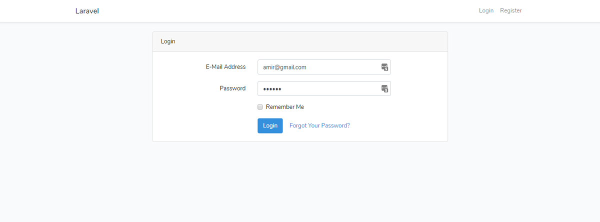
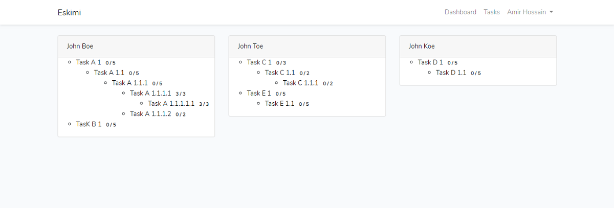

# Task Management Definition
A simple task management app. Built a task management application using laravel 5.8. The following features are included.

<ul>
    <li> PHP & Laravel 5.8</li>
    <li>Provides API endpoints (CURD)</li>
    <li>Followed PSR-2 style guideline</li>
    <li>Use GuzzleHttp Client to get user list from 3rd party application</li>
    <li>Followed OOP</li>
    <li>Use Traits</li>
    <li>Repository design pattern</li>
    <li>Single responsibility</li>
    <li>PhpUnit testing</li>
</ul>

## Installation and use

```
$ git clone git@github.com:amirphp7/eskimi-task.git
```
```
$ cd eskimi-task
```
```
$ mv .env.example .env
```
```
$ php artisan key:generate
```

**Change configuration according your need and create Database**
```
$ composer install
```
**If missing any packages**
```
$ composer update
```
**To get node modules**
```
$ npm install
```
**To generate .sass/.js into browser readable format**
```
$ npm run dev
```
```
$ php artisan migrate
```
```
$ php artisan serve
```
**  http://localhost:8000 **

**Unit Test**
I have used sqlite in memory database. All configuration for unit testing made in the phpunit.xml. and .env.testing files. To create sqlite databse run

```
$ touch database.sqlite
```

## Screenshots



## License
Task Manage is open-sourced software licensed under the [GPL-3.0 license](https://opensource.org/licenses/GPL-3.0).
Frameworks and libraries has it own licensed
